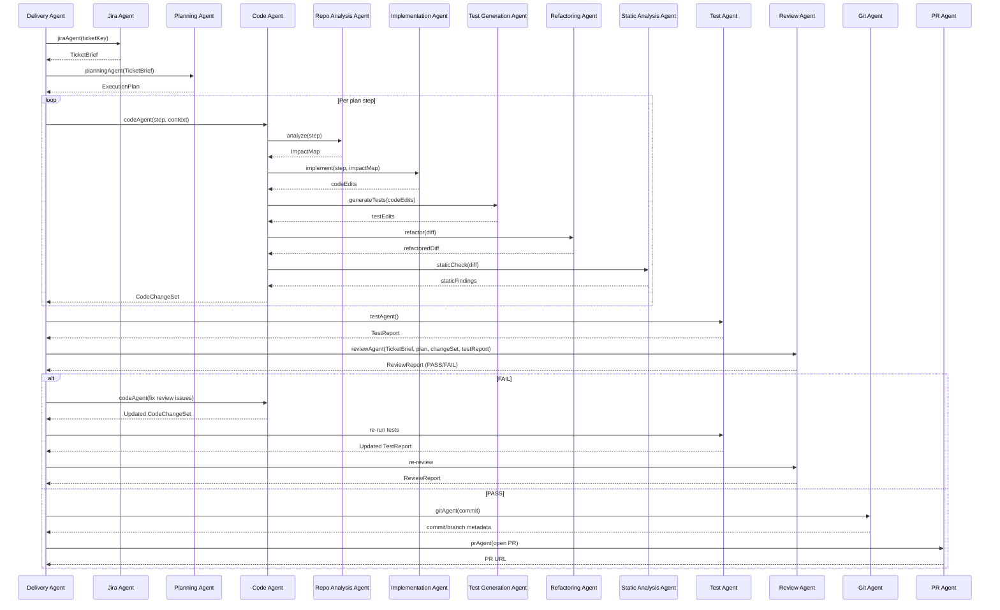

# Agents-as-Tools Orchestration Architecture (First Pass)

This document defines the first-pass architecture for an autonomous software delivery workflow using the **Agents-as-Tools** pattern with the GitHub Copilot Java SDK.

## 1) Architecture overview

### Core idea
- A top-level **Delivery Agent** is the orchestrator.
- Specialist capabilities are exposed as **tools** (Jira, Planning, Code, Test, Review, Git, PR).
- The Delivery Agent coordinates flow/state and does not perform specialist work directly.
- The **Code Agent** is also an orchestrator over deeper specialist tools:
  - Repository Analysis Agent
  - Implementation Agent
  - Test Generation Agent
  - Refactoring Agent
  - Static Analysis Agent

### Workflow scope
`Jira -> Planning -> Code -> Test -> Review -> Git -> PR` with review/fix retries before Git/PR.

---

## 2) Agent responsibilities

### Delivery Agent (orchestrator)
- Owns end-to-end state machine for one ticket.
- Invokes specialist tools in order.
- Applies retry/stop policy and records execution summary.
- Decides when work is complete and safe to hand to Git/PR.

### Jira Agent
- Fetches ticket, linked items, acceptance criteria, and constraints.
- Normalizes ticket data into an execution-ready brief.

### Planning Agent
- Produces an implementation plan, risks, and verification strategy.
- Splits work into executable steps for the Code Agent.

### Code Agent (orchestrator)
- Owns implementation of plan steps.
- Delegates code work to sub-agents and aggregates results.

#### Code Agent sub-agents
- **Repository Analysis Agent**: locates affected modules, patterns, invariants.
- **Implementation Agent**: applies code changes for current step.
- **Test Generation Agent**: adds/updates tests for changed behavior.
- **Refactoring Agent**: improves structure while preserving behavior.
- **Static Analysis Agent**: runs lint/static checks and reports defects.

### Test Agent
- Runs project test commands, summarizes failures, categorizes flake vs deterministic failures.
- Returns actionable failure feedback for retry loops.

### Review Agent
- Performs quality and correctness review (requirements, safety, edge cases, maintainability).
- Emits pass/fail verdict plus issue list mapped to severity.

### Git Agent
- Creates/uses branch, commits validated changes, prepares push metadata.

### PR Agent
- Creates PR title/body with testing evidence, ticket link, and change summary.

---

## 3) Inputs and outputs

| Agent | Inputs | Outputs |
|---|---|---|
| Delivery Agent | Ticket key or normalized ticket payload; workflow policy | Workflow state, final execution report, handoff decision |
| Jira Agent | Ticket key, project context | `TicketBrief` (goal, acceptance criteria, links, constraints) |
| Planning Agent | `TicketBrief` | `ExecutionPlan` (ordered steps, risks, validation plan, done criteria) |
| Code Agent | `ExecutionPlan`, repo/worktree context, prior review feedback | `CodeChangeSet` (files changed, rationale, pending risks) |
| Repository Analysis Agent | Plan step, repo context | Impact map (files, APIs, dependencies, constraints) |
| Implementation Agent | Plan step + impact map | Concrete code edits + implementation notes |
| Test Generation Agent | Changed behavior + changed files | New/updated tests + mapping to acceptance criteria |
| Refactoring Agent | Current diff + style constraints | Refactored diff with behavior-preservation notes |
| Static Analysis Agent | Current diff/worktree | Static findings + severity + remediation guidance |
| Test Agent | Worktree + test command config | `TestReport` (pass/fail, failures, flaky signals, logs summary) |
| Review Agent | `TicketBrief`, `ExecutionPlan`, `CodeChangeSet`, `TestReport` | `ReviewReport` (PASS/FAIL, issues list, required actions) |
| Git Agent | Approved change set + commit conventions | Branch/commit metadata, commit SHA |
| PR Agent | Commit/branch metadata + reports | PR title/body/checklist, PR URL/ID |

---

## 4) Sequence diagram



---

## 5) Retry/review loop design

### Loop triggers
- Test failures from Test Agent.
- FAIL verdict or blocking findings from Review Agent.
- Blocking static analysis findings from Code Agent static-analysis stage.

### Policy
- Retry budget: configurable max attempts (for example: 3 full fix cycles).
- Each retry carries forward only structured feedback (issue IDs, file hints, expected outcome) to constrain context size.
- Re-run minimal affected tests first; run broader suite before final approval.

### Exit conditions
- **Success**: tests pass, review PASS, no blocking findings.
- **Escalate/Stop**: retry budget exhausted or unresolved high-severity issue.

---

## 6) Suggested package/module structure

First-pass target structure (incremental; keeps current code working while introducing boundaries):

```text
src/main/java/com/github/developmentagent/
  DevelopmentAgent.java
  workflow/
    DeliveryWorkflow.java
    WorkflowState.java
    RetryPolicy.java
  domain/
    Ticket.java
    TicketBrief.java
    ExecutionPlan.java
    CodeChangeSet.java
    TestReport.java
    ReviewReport.java
  agents/
    jira/JiraAgentTool.java
    planning/PlanningAgentTool.java
    code/CodeAgentTool.java
    code/subagents/RepositoryAnalysisAgentTool.java
    code/subagents/ImplementationAgentTool.java
    code/subagents/TestGenerationAgentTool.java
    code/subagents/RefactoringAgentTool.java
    code/subagents/StaticAnalysisAgentTool.java
    test/TestAgentTool.java
    review/ReviewAgentTool.java
    git/GitAgentTool.java
    pr/PRAgentTool.java
  sdk/
    SessionFactory.java
    ToolRegistry.java
    PromptTemplates.java
```

Implementation note: specialist tools map naturally to SDK tool methods using `@CopilotTool`, while Delivery/Code orchestrators call those tools through session interactions.

---

## 7) Incremental implementation roadmap

### MVP (Phase 1)
- Keep current single-session model.
- Introduce explicit Delivery workflow state machine (`Jira -> Plan -> Code -> Review`).
- Convert existing phases into tool-like interfaces and typed outputs.

### Phase 2
- Add Test Agent and Git Agent integration.
- Add structured retry loop with capped attempts and deterministic stop conditions.
- Persist per-ticket execution summaries.

### Phase 3
- Add PR Agent and richer review gates.
- Introduce Code Agent as nested orchestrator with Repository Analysis + Implementation + Test Generation sub-agents.

### Phase 4
- Add Refactoring and Static Analysis sub-agents in Code Agent.
- Add policy configuration (risk thresholds, approval gates, retry budgets).

### Phase 5 (full capability)
- Parallelizable subtasks where safe.
- Better observability (timings, per-agent metrics, trace IDs).
- Optional specialist agents (Security, Performance) plugged in as additional tools without changing orchestration core.

---

## Copilot SDK alignment notes

- Use `CopilotClient` and `CopilotSession` as orchestration runtime.
- Register specialist tool methods with `@CopilotTool` and parameter contracts via `@CopilotToolParam`.
- Keep orchestrator prompts focused on control decisions; keep specialist prompts domain-specific.
- Favor typed intermediate models (plan/review/test reports) to reduce ambiguity between phases.
